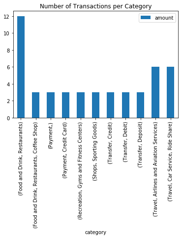
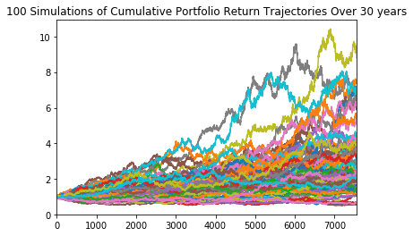
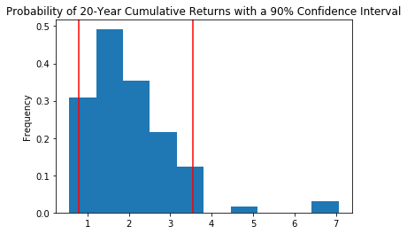

# Unit 5 Homework: APIs - Financial Report

## Budget Analysis Summary:

When looking through the transaction data of the last 90 days, when grouped by category, it seems that the activity of their money is moving it in between accounts, whether paying account balances or being paid. One area of actual expenses that should be further examined is in food and entertainment, as a fair amount of money was spent on those categories. This is most notable when comparing the number of transactions across the various categories. 

As for expenses per month, if nothing else, they are at least consistent, therefore, changing spending behavior may be a bit more feasible than if it were more erratic.

## Retirement Portfolio Analysis Summary:

The retirement portfolio is made up of 60% SPY (stocks) and 40% AGG (bonds) holdings. Having this portfolio established, we then ran 100 simulations of 30 years’ worth of returns for this portfolio, as shown in this Monte Carlo graph. 

Having this data, we then calculated cumulative returns for at the 20-year and 30-year marks. Then proceeded to calculate the 90% confidence interval for the 20-year cumulative returns, as shown in this histogram. 

Later, the cumulative returns for the 10th, 50th, and 90th percentile was generated. After generating the cumulative returns for the respective percentiles, the expected portfolio return was generated, with an initial investment of $20,000, for the respective percentiles. Then a comparison was drawn up to compare a 4% withdrawal rate from the 30-year cumulative return portfolio, within a 90% confidence interval, to the cumulative return of the 30-year portfolio at the 10th percentile. With an initial investment of $20,000 over 30 years, the lower confidence interval will not exceed the returns or withdrawal rate at the 10th percentile. However, the upper confidence interval limit would clear both the 10th percentile return value and withdrawal rate. A 50% increase would not change much because both the 90% confidence interval returns will increase as well as the 10th percentile returns. 